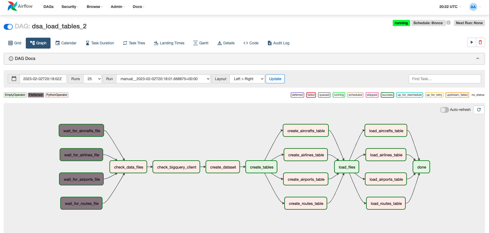

# Airspace ETL project

#### By [Ruben Giosa](https://www.linkedin.com/in/rubengiosa/)

#### This repo showcases an iteration of an ETL from Data Stack Academy that is triggered when csv files are detected in data directory and adds additional task for creating a dataset. It then creates 1) dataset 2) tables in BigQuery.

<br>

## Technologies Used

* BigQuery
* Airflow
* Docker
* Python
* Pandas
* Git
* Markdown
* `.gitignore`
* `requirements.txt`
  

</br>

## Description

This repo showcases work with Airflow to leverage a DAG for automation of the below steps:
* Utilizes `FileSensor` to kick off DAG once ALL expected csv files loaded into data directory
* Performs an additional check to ensure data files and bigquery connection is good
* Creates dataset
* creates BigQuery tables for: airports, airlines, routes, aircrafts
* Load these tables from CSV data files


#### DAG Structure:


<br>

## Setup/Installation Requirements

* Go to https://github.com/rgiosa10/airflow-project-2.git to find the specific repository for this website.
* Then open your terminal. I recommend going to your Desktop directory:
    ```bash
    cd Desktop
    ```
* Then clone the repository by inputting: 
  ```bash
  git clone https://github.com/rgiosa10/airflow-project-2.git
  ```
* Go to the new directory or open the directory folder on your desktop:
  ```bash
  cd airflow-project-2
  ```
* open the directory in VS Code:
  ```bash
  code .
  ```
* Once VS Code is open, then run the setup file:
  ```bash
  ./setup.sh
  ```
* Then run the airflow setup file:
  ```bash
  ./airflow_setup.sh
  ```

</br>

## Known Bugs

* No known bugs

<br>

## License

MIT License

Copyright (c) 2022 Ruben Giosa

Permission is hereby granted, free of charge, to any person obtaining a copy of this software and associated documentation files (the "Software"), to deal in the Software without restriction, including without limitation the rights to use, copy, modify, merge, publish, distribute, sublicense, and/or sell copies of the Software, and to permit persons to whom the Software is furnished to do so, subject to the following conditions:

The above copyright notice and this permission notice shall be included in all copies or substantial portions of the Software.

THE SOFTWARE IS PROVIDED "AS IS", WITHOUT WARRANTY OF ANY KIND, EXPRESS OR IMPLIED, INCLUDING BUT NOT LIMITED TO THE WARRANTIES OF MERCHANTABILITY, FITNESS FOR A PARTICULAR PURPOSE AND NONINFRINGEMENT. IN NO EVENT SHALL THE AUTHORS OR COPYRIGHT HOLDERS BE LIABLE FOR ANY CLAIM, DAMAGES OR OTHER LIABILITY, WHETHER IN AN ACTION OF CONTRACT, TORT OR OTHERWISE, ARISING FROM, OUT OF OR IN CONNECTION WITH THE SOFTWARE OR THE USE OR OTHER DEALINGS IN THE SOFTWARE.

</br>